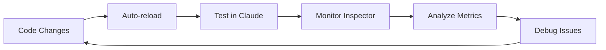
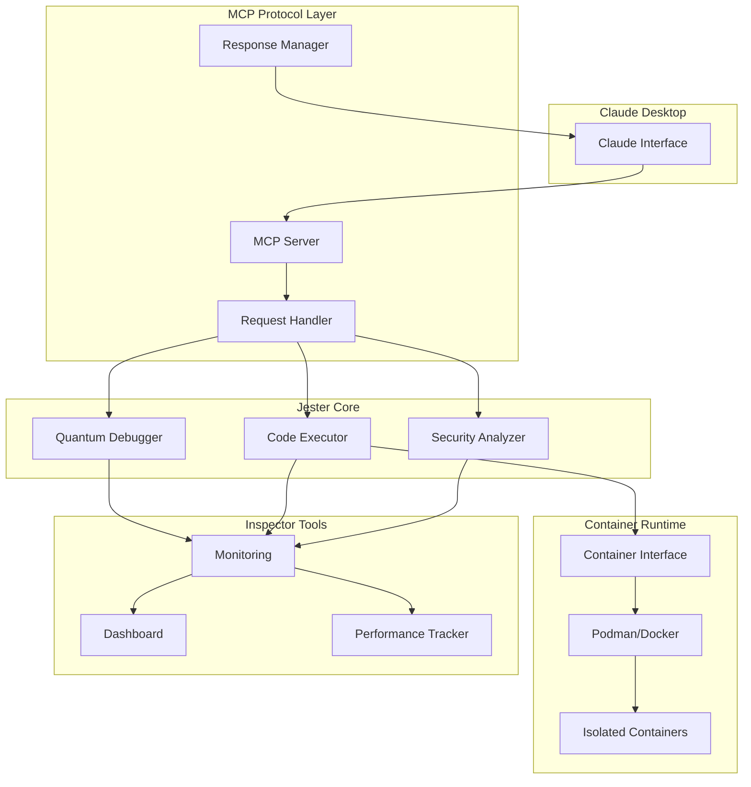

# Jester MCP Development Guide

**Transform your development experience with quantum debugging, real-time inspection, and enterprise-grade testing tools.**


## 🚀 Quick Start for Developers

### Prerequisites

- **Python 3.7+** (3.9+ recommended)
- **Container Runtime**: Podman (preferred) or Docker
- **Claude Desktop** (for MCP testing)
- **Git** (for version control)

### One-Minute Setup

```bash
# Clone the repository
git clone https://github.com/mstanton/jester-mcp.git
cd jester-mcp

# Install development tools (one-click installer)
python3 install_inspector.py

# Start development server
python dev_server.py
```

**🎯 You're ready!** Open http://localhost:8000 for the inspector dashboard.

## 📚 Table of Contents

- [Development Environment Setup](#-development-environment-setup)
- [Inspector Dashboard](#-inspector-dashboard)
- [Development Workflow](#-development-workflow)
- [Testing Framework](#-testing-framework)
- [Debugging Guide](#-debugging-guide)
- [Performance Optimization](#-performance-optimization)
- [Security Development](#-security-development)
- [Container Development](#-container-development)
- [Contributing Guidelines](#-contributing-guidelines)
- [Architecture Deep Dive](#-architecture-deep-dive)
- [Troubleshooting](#-troubleshooting)

## 🛠 Development Environment Setup

### Detailed Setup Process

#### 1. Environment Preparation

```bash
# Create development directory
mkdir jester-mcp-dev
cd jester-mcp-dev

# Clone repository
git clone https://github.com/mstanton/jester-mcp.git .

# Create virtual environment (recommended)
python3 -m venv venv
source venv/bin/activate  # Linux/macOS
# or
venv\Scripts\activate     # Windows

# Install base dependencies
pip install -r requirements.txt
```

#### 2. Development Tools Installation

```bash
# Option A: Automatic installer (recommended)
python3 install_inspector.py

# Option B: Manual setup
python3 integration_setup.py setup

# Option C: Dependencies only
pip install fastapi uvicorn websockets psutil pyyaml pytest watchdog
```

#### 3. Container Runtime Setup

**Podman (Recommended for Security):**
```bash
# macOS
brew install podman

# Ubuntu/Debian
sudo apt-get install podman

# Initialize rootless containers
podman system reset --force
podman info  # Verify installation
```

**Docker (Alternative):**
```bash
# Install Docker Desktop or Docker Engine
# Ensure current user is in docker group (Linux)
sudo usermod -aG docker $USER
```

#### 4. Claude Desktop Configuration

The installer automatically configures Claude Desktop, but for manual setup:

**macOS:**
```bash
# Edit: ~/Library/Application Support/Claude/claude_desktop_config.json
{
  "mcpServers": {
    "jester-mcp": {
      "command": "python3",
      "args": ["/absolute/path/to/dev_server.py"],
      "env": {
        "JESTER_DEBUG": "true",
        "JESTER_INSPECTOR_PORT": "8000"
      }
    }
  }
}
```

**Windows:**
```bash
# Edit: %APPDATA%\Claude\claude_desktop_config.json
```

**Linux:**
```bash
# Edit: ~/.config/claude/claude_desktop_config.json
```

### Environment Verification

```bash
# Health check
python check_health.py

# Expected output:
# 🏥 Jester MCP Health Check
# ✅ standalone_mcp_server.py
# ✅ mcp_inspector.py
# ✅ dev_server.py
# 📦 Core Dependencies:
# ✅ json
# ✅ asyncio
# ✅ pathlib
# 🎉 Health check passed! Ready to develop.
```

## 📊 Inspector Dashboard

### Real-Time MCP Protocol Monitoring

The inspector dashboard provides comprehensive visibility into MCP communication:

#### Dashboard Features

**Message Stream Panel:**
- Live MCP request/response monitoring
- Color-coded message types (inbound/outbound/errors)
- Timestamp and execution time tracking
- JSON payload inspection with syntax highlighting
- Message filtering and search

**Performance Metrics Panel:**
- Total message count and error rates
- Average response times with statistical analysis
- Method-specific performance breakdowns
- System resource utilization (CPU, memory, disk)
- Real-time performance graphs

**Controls:**
- Record/pause message capture
- Clear message history
- Export debugging data (JSON format)
- Performance metric reset
- Real-time vs historical view toggle

#### Using the Inspector

1. **Start Development Server:**
   ```bash
   python dev_server.py
   ```

2. **Open Dashboard:**
   - Navigate to http://localhost:8000
   - Dashboard auto-refreshes every 2 seconds

3. **Monitor Claude Interaction:**
   - Send commands to Claude in Claude Desktop
   - Watch real-time MCP messages in the dashboard
   - Analyze performance metrics and error patterns

4. **Debug Issues:**
   - Use message export for bug reports
   - Analyze timing for performance optimization
   - Track error patterns for reliability improvements

### Advanced Inspector Features

#### Message Filtering

```javascript
// Filter by method
messages.filter(m => m.method === 'execute_code')

// Filter by execution time
messages.filter(m => m.execution_time > 100)  // >100ms

// Filter errors only
messages.filter(m => m.error !== null)
```

#### Performance Analysis

- **Response Time Percentiles**: P50, P95, P99 analysis
- **Throughput Metrics**: Messages per second
- **Error Rate Tracking**: Error percentage over time
- **Resource Correlation**: Performance vs system load

#### Export Formats

```bash
# JSON export (default)
curl http://localhost:8000/api/messages > debug_session.json

# Performance metrics only
curl http://localhost:8000/api/metrics > performance_data.json
```

## 🔄 Development Workflow

### Daily Development Process

#### 1. Start Development Session

```bash
# Start enhanced development server
python dev_server.py

# Or use quick start (opens browser automatically)
python quick_start.py
```

#### 2. Development Loop



#### 3. Testing Integration

```bash
# Run test suite during development
python run_tests.py

# Quick verification
python check_health.py

# Specific test categories
python run_tests.py --category protocol
python run_tests.py --category security
python run_tests.py --category performance
```

### File Change Monitoring

The development server automatically monitors file changes:

**Watched Files:**
- `standalone_mcp_server.py` - Core server logic
- `*.py` files in project directory
- Configuration files
- Tool definitions

**Auto-reload Triggers:**
- File modification detection
- Graceful server restart
- Connection state preservation
- Cache invalidation

### Development Commands Reference

| Command | Purpose | Use Case |
|---------|---------|----------|
| `python dev_server.py` | Start with debugging | Primary development |
| `python standalone_mcp_server.py` | Production mode | Testing production behavior |
| `python run_tests.py` | Full test suite | Pre-commit verification |
| `python check_health.py` | Environment check | Setup verification |
| `python quick_start.py` | Quick development start | Fast iteration |

## 🧪 Testing Framework

### Comprehensive Testing Architecture

#### Test Categories

**1. MCP Protocol Tests**
```python
# Test MCP compliance
async def test_initialize():
    response = await client.send_request("initialize", {
        "protocolVersion": "2024-11-05",
        "capabilities": {}
    })
    assert response["result"]["protocolVersion"] == "2024-11-05"

# Test tool registration
async def test_tools_list():
    response = await client.send_request("tools/list", {})
    tools = response["result"]["tools"]
    assert any(tool["name"] == "jester-mcp:execute_code" for tool in tools)
```

**2. Quantum Debugging Tests**
```python
# Test algorithm optimization
async def test_quantum_optimization():
    result = await execute_quantum_task("find fastest sorting")
    assert result["algorithms_tested"] >= 3
    assert result["best_algorithm"]["complexity"] <= "O(n log n)"
    assert result["speedup_factor"] > 1.0
```

**3. Container Security Tests**
```python
# Test isolation
async def test_container_isolation():
    # Should fail - filesystem access blocked
    result = await execute_in_container("import os; os.listdir('/')")
    assert result["error"] is not None
    
    # Should succeed - safe computation
    result = await execute_in_container("print(sum(range(100)))")
    assert result["success"] is True
```

**4. Performance Benchmarks**
```python
# Benchmark execution modes
async def test_execution_performance():
    benchmarks = await benchmark_all_modes("sum(range(1000))")
    
    # Verify execution times are reasonable
    assert benchmarks["subprocess"]["time"] < 0.1
    assert benchmarks["container"]["time"] < 0.5
    assert benchmarks["isolation"]["time"] < 1.0
```

#### Running Tests

**Full Test Suite:**
```bash
python run_tests.py

# Expected output:
# 🧪 Running MCP Protocol Tests...
# ✅ initialize: passed
# ✅ tools_list: passed
# ✅ execute_code: passed
# 
# 🛡️ Running Security Tests...
# ✅ file_system_isolation: passed
# ✅ network_isolation: passed
# ✅ memory_limit: passed
# 
# ⚡ Running Performance Benchmarks...
# ✅ Subprocess: 45ms avg
# ✅ Container: 180ms avg
# ✅ Isolation: 280ms avg
# 
# 📊 Test Results: 12/12 passed
```

**Specific Test Categories:**
```bash
# Protocol tests only
python -m pytest tests/test_protocol.py -v

# Security tests only
python -m pytest tests/test_security.py -v

# Performance benchmarks
python -m pytest tests/test_performance.py -v --benchmark
```

#### Custom Test Development

**Creating New Tests:**
```python
# tests/test_custom_feature.py
import pytest
from test_utils import MCPTestClient

@pytest.mark.asyncio
async def test_custom_feature():
    client = MCPTestClient()
    
    # Test your feature
    result = await client.execute_code(
        language="python",
        code="your_test_code_here"
    )
    
    # Assertions
    assert result["success"] is True
    assert "expected_output" in result["output"]
```

### Continuous Integration Tests

**Pre-commit Hooks:**
```bash
# Install pre-commit
pip install pre-commit
pre-commit install

# Manual run
pre-commit run --all-files
```

**CI Pipeline Tests:**
```yaml
# .github/workflows/test.yml
name: Test Jester MCP
on: [push, pull_request]
jobs:
  test:
    runs-on: ubuntu-latest
    steps:
      - uses: actions/checkout@v3
      - name: Setup Python
        uses: actions/setup-python@v4
        with:
          python-version: '3.9'
      - name: Install dependencies
        run: pip install -r requirements.txt
      - name: Run tests
        run: python run_tests.py
```

## 🐛 Debugging Guide

### Enhanced Debugging Capabilities

#### Real-Time Debugging

**Inspector Dashboard Debugging:**
1. Start development server: `python dev_server.py`
2. Open dashboard: http://localhost:8000
3. Execute commands in Claude Desktop
4. Monitor message flow in real-time
5. Analyze timing and error patterns

**Message Flow Analysis:**
```bash
# Watch for specific patterns
curl http://localhost:8000/api/messages | jq '.messages[] | select(.error != null)'

# Performance analysis
curl http://localhost:8000/api/metrics | jq '.mcp_metrics'
```

#### Debugging Common Issues

**1. MCP Connection Issues**
```python
# Check server startup
python standalone_mcp_server.py

# Expected output:
# {"jsonrpc":"2.0","id":1,"method":"initialize","params":{}}
```

**2. Container Execution Problems**
```bash
# Test container runtime
podman run --rm python:3.9 python -c "print('Container test')"

# Check container logs
python dev_server.py 2>&1 | grep -i container
```

**3. Performance Issues**
```python
# Enable detailed logging
export JESTER_DEBUG=true
export JESTER_LOG_LEVEL=DEBUG
python dev_server.py
```

#### Advanced Debugging Techniques

**1. Quantum Debugging Deep Dive**
```python
# Enable algorithm testing debug mode
async def debug_quantum_execution():
    result = await quantum_debug(
        task="optimize sorting algorithm",
        debug_level="verbose",
        preserve_intermediates=True
    )
    
    # Analyze each tested algorithm
    for algo in result["tested_algorithms"]:
        print(f"Algorithm: {algo['name']}")
        print(f"Complexity: {algo['complexity']}")
        print(f"Performance: {algo['time']}ms")
        print(f"Memory: {algo['memory']}MB")
```

**2. Container Debugging**
```bash
# Debug container creation
podman run -it --rm \
  --network none \
  --read-only \
  --tmpfs /tmp \
  python:3.9 /bin/bash

# Inside container - test restrictions
python -c "import os; print(os.listdir('/'))"  # Should be limited
```

**3. MCP Protocol Debugging**
```python
# Raw MCP message inspection
import json

def debug_mcp_message(message):
    print("=== MCP MESSAGE DEBUG ===")
    print(f"Direction: {message.direction}")
    print(f"Method: {message.method}")
    print(f"Timestamp: {message.timestamp}")
    print(f"Content: {json.dumps(message.content, indent=2)}")
    if message.error:
        print(f"Error: {message.error}")
    print("=" * 25)
```

### Error Analysis and Resolution

#### Common Error Patterns

**1. Execution Timeouts**
```python
# Cause: Long-running code in containers
# Solution: Implement timeout handling
async def execute_with_timeout(code, timeout=30):
    try:
        return await asyncio.wait_for(
            execute_code(code), 
            timeout=timeout
        )
    except asyncio.TimeoutError:
        return {"error": "Execution timeout", "timeout": timeout}
```

**2. Container Permission Issues**
```bash
# Cause: Podman not properly configured
# Solution: Reset and reconfigure
podman system reset --force
podman system migrate
```

**3. MCP Protocol Errors**
```python
# Cause: Invalid request format
# Solution: Validate before sending
def validate_mcp_request(request):
    required_fields = ["jsonrpc", "id", "method"]
    for field in required_fields:
        if field not in request:
            raise ValueError(f"Missing required field: {field}")
    
    if request["jsonrpc"] != "2.0":
        raise ValueError("Invalid JSON-RPC version")
```

## ⚡ Performance Optimization

### Performance Monitoring

#### Real-Time Metrics

**Dashboard Metrics:**
- **Response Time**: Average, P95, P99 percentiles
- **Throughput**: Messages per second
- **Error Rate**: Percentage of failed requests
- **Resource Usage**: CPU, memory, disk utilization

**Performance Baselines:**
```python
# Expected performance targets
PERFORMANCE_TARGETS = {
    "subprocess_execution": {"max_time": 100},      # 100ms
    "container_startup": {"max_time": 500},         # 500ms
    "mcp_response": {"max_time": 50},               # 50ms
    "quantum_optimization": {"min_speedup": 2.0}    # 2x improvement
}
```

#### Optimization Strategies

**1. Execution Mode Selection**
```python
# Automatic mode selection based on code characteristics
def select_execution_mode(code, security_level):
    if security_level == "maximum":
        return "isolation_container"
    elif "import" in code or "file" in code:
        return "container"
    else:
        return "subprocess"  # Fastest for simple code
```

**2. Container Optimization**
```python
# Persistent container pool
class ContainerPool:
    def __init__(self, pool_size=3):
        self.pool = []
        self.pool_size = pool_size
    
    async def get_container(self):
        if self.pool:
            return self.pool.pop()
        else:
            return await self.create_container()
    
    async def return_container(self, container):
        if len(self.pool) < self.pool_size:
            await self.reset_container(container)
            self.pool.append(container)
        else:
            await container.remove()
```

**3. Quantum Algorithm Caching**
```python
# Cache optimization results
class OptimizationCache:
    def __init__(self):
        self.cache = {}
    
    def get_optimization(self, code_hash):
        return self.cache.get(code_hash)
    
    def store_optimization(self, code_hash, result):
        self.cache[code_hash] = {
            "result": result,
            "timestamp": time.time()
        }
```

### Benchmarking Tools

#### Built-in Benchmarking

```python
# Run comprehensive benchmarks
async def run_performance_benchmark():
    benchmark_suite = PerformanceBenchmark()
    
    results = await benchmark_suite.run_all([
        "simple_calculation",
        "file_operations", 
        "algorithm_optimization",
        "container_startup",
        "mcp_protocol_overhead"
    ])
    
    # Generate performance report
    report = benchmark_suite.generate_report(results)
    print(report)
```

#### Custom Benchmarks

```python
# Create custom benchmarks for your use cases
@benchmark
async def custom_benchmark():
    start_time = time.time()
    
    # Your code to benchmark
    result = await your_function()
    
    execution_time = time.time() - start_time
    return {
        "execution_time": execution_time,
        "result": result,
        "memory_usage": get_memory_usage()
    }
```

## 🔒 Security Development

### Security-First Development Approach

#### Container Security

**Isolation Levels:**
```python
SECURITY_LEVELS = {
    "development": {
        "network": "limited",      # Some network access
        "filesystem": "read_only", # Read-only filesystem
        "capabilities": "basic"    # Basic capabilities
    },
    "production": {
        "network": "none",         # No network access
        "filesystem": "tmpfs_only", # Temporary filesystem only
        "capabilities": "dropped"   # All capabilities dropped
    },
    "maximum": {
        "network": "none",
        "filesystem": "none",       # No filesystem access
        "capabilities": "none",     # No capabilities
        "user_namespace": True      # User namespace isolation
    }
}
```

**Security Validation:**
```python
# Automatic security testing
async def validate_container_security():
    tests = [
        test_filesystem_isolation,
        test_network_isolation,
        test_privilege_escalation,
        test_resource_limits,
        test_capability_restrictions
    ]
    
    results = []
    for test in tests:
        try:
            result = await test()
            results.append({"test": test.__name__, "passed": True})
        except SecurityViolation as e:
            results.append({"test": test.__name__, "passed": False, "error": str(e)})
    
    return results
```

#### Code Analysis

**Pattern Detection:**
```python
# Detect potentially dangerous patterns
DANGEROUS_PATTERNS = [
    r"import\s+os",              # Filesystem access
    r"open\s*\(",               # File operations
    r"subprocess\.",            # Process execution
    r"eval\s*\(",              # Code evaluation
    r"exec\s*\(",              # Code execution
    r"__import__",             # Dynamic imports
    r"socket\.",               # Network operations
]

def analyze_code_security(code):
    risks = []
    for pattern in DANGEROUS_PATTERNS:
        if re.search(pattern, code):
            risks.append(f"Potential security risk: {pattern}")
    return risks
```

#### Security Monitoring

```python
# Real-time security monitoring
class SecurityMonitor:
    def __init__(self):
        self.violations = []
        self.alerts = []
    
    def log_violation(self, violation_type, details):
        violation = {
            "type": violation_type,
            "details": details,
            "timestamp": time.time(),
            "severity": self.assess_severity(violation_type)
        }
        self.violations.append(violation)
        
        if violation["severity"] >= "HIGH":
            self.trigger_alert(violation)
    
    def trigger_alert(self, violation):
        # Send alert to monitoring system
        alert = f"SECURITY ALERT: {violation['type']} - {violation['details']}"
        self.alerts.append(alert)
        print(f"🚨 {alert}")
```

## 🐋 Container Development

### Advanced Container Management

#### Container Lifecycle

```python
class ContainerLifecycle:
    def __init__(self, runtime="podman"):
        self.runtime = runtime
        self.active_containers = {}
    
    async def create_container(self, security_level="development"):
        config = SECURITY_LEVELS[security_level]
        
        container = await self.runtime.create_container(
            image="python:3.9-alpine",
            network=config["network"],
            read_only=config["filesystem"] == "read_only",
            tmpfs={"/tmp": "rw,noexec,nosuid,size=100m"},
            cap_drop=["ALL"] if config["capabilities"] == "dropped" else [],
            user="nobody" if config.get("user_namespace") else None
        )
        
        self.active_containers[container.id] = container
        return container
    
    async def execute_in_container(self, container, code):
        # Execute code with monitoring
        start_time = time.time()
        
        try:
            result = await container.exec_run([
                "python", "-c", code
            ], timeout=30)
            
            execution_time = time.time() - start_time
            
            return {
                "success": True,
                "output": result.output.decode(),
                "execution_time": execution_time
            }
        except Exception as e:
            return {
                "success": False,
                "error": str(e),
                "execution_time": time.time() - start_time
            }
    
    async def cleanup_container(self, container):
        try:
            await container.stop(timeout=5)
            await container.remove()
            if container.id in self.active_containers:
                del self.active_containers[container.id]
        except Exception as e:
            print(f"Error cleaning up container: {e}")
```

#### Container Optimization

**Image Optimization:**
```dockerfile
# Optimized Python container for jester-mcp
FROM python:3.9-alpine

# Install only essential packages
RUN apk add --no-cache \
    gcc \
    musl-dev \
    && pip install --no-cache-dir \
    numpy \
    scipy \
    && apk del gcc musl-dev

# Create non-root user
RUN adduser -D -s /bin/sh jester

# Set up working directory
WORKDIR /app
USER jester

# Default command
CMD ["python"]
```

**Performance Monitoring:**
```python
# Monitor container resource usage
async def monitor_container_resources(container):
    stats = await container.stats(stream=False)
    
    return {
        "cpu_usage": stats["cpu_stats"]["cpu_usage"]["total_usage"],
        "memory_usage": stats["memory_stats"]["usage"],
        "memory_limit": stats["memory_stats"]["limit"],
        "network_rx": stats["networks"]["eth0"]["rx_bytes"],
        "network_tx": stats["networks"]["eth0"]["tx_bytes"]
    }
```

## 🤝 Contributing Guidelines

### Development Process

#### 1. Setting Up for Contribution

```bash
# Fork the repository on GitHub
# Clone your fork
git clone https://github.com/YOUR_USERNAME/jester-mcp.git
cd jester-mcp

# Add upstream remote
git remote add upstream https://github.com/mstanton/jester-mcp.git

# Create development branch
git checkout -b feature/your-feature-name

# Install development tools
python install_inspector.py
```

#### 2. Development Standards

**Code Quality:**
- Follow PEP 8 style guidelines
- Use type hints for all function parameters and returns
- Write comprehensive docstrings
- Maintain test coverage above 80%

**Commit Guidelines:**
```bash
# Commit message format
type(scope): description

# Examples
feat(quantum): add new algorithm optimization
fix(container): resolve memory leak in isolation mode  
docs(readme): update installation instructions
test(security): add container escape tests
```

**Code Review Process:**
1. Create feature branch
2. Implement changes with tests
3. Run full test suite: `python run_tests.py`
4. Create pull request with detailed description
5. Address review feedback
6. Merge after approval

#### 3. Testing Requirements

**Required Tests for New Features:**
```python
# Unit tests
def test_feature_basic_functionality():
    """Test basic feature operation"""
    pass

def test_feature_error_handling():
    """Test error conditions and edge cases"""
    pass

def test_feature_performance():
    """Test performance meets requirements"""
    pass

# Integration tests
async def test_feature_mcp_integration():
    """Test feature works with MCP protocol"""
    pass

async def test_feature_container_integration():
    """Test feature works in container environment"""
    pass
```

#### 4. Documentation Requirements

**New Feature Documentation:**
- Update README.md with usage examples
- Add docstrings with examples
- Create or update relevant documentation in `/docs`
- Add entry to CHANGELOG.md

### Architecture Guidelines

#### Design Principles

1. **Security First**: All code execution must be containerized
2. **Performance Focused**: Optimize for speed and efficiency
3. **Extensible**: Design for easy feature addition
4. **Observable**: Include comprehensive logging and metrics
5. **Reliable**: Handle errors gracefully with fallbacks

#### Module Structure

```
jester-mcp/
├── src/
│   ├── core/              # Core MCP server functionality
│   ├── quantum/           # Quantum debugging algorithms
│   ├── container/         # Container management
│   ├── security/          # Security analysis and enforcement
│   └── inspector/         # Development tools and monitoring
├── tests/
│   ├── unit/             # Unit tests
│   ├── integration/      # Integration tests
│   └── performance/      # Performance benchmarks
├── docs/                 # Documentation
├── scripts/              # Utility scripts
└── tools/                # Development tools
```

## 🏗 Architecture Deep Dive

### System Architecture



### Component Details

#### MCP Protocol Layer
- **Request Parsing**: JSON-RPC 2.0 protocol handling
- **Tool Registration**: Dynamic tool discovery and registration
- **Response Formatting**: Standardized response formatting
- **Error Handling**: Comprehensive error reporting

#### Quantum Debugger
- **Algorithm Testing**: Parallel algorithm execution and comparison
- **Performance Analysis**: Statistical performance measurement
- **Optimization Discovery**: Automatic optimization identification
- **Mathematical Insights**: Complexity analysis and recommendations

#### Container Runtime Integration
- **Multi-Runtime Support**: Podman and Docker compatibility
- **Security Enforcement**: Capability dropping and isolation
- **Resource Management**: Memory and CPU limits
- **Network Isolation**: Zero-trust networking

#### Inspector Tools
- **Real-Time Monitoring**: Live message stream analysis
- **Performance Metrics**: Comprehensive performance tracking
- **Debug Visualization**: Interactive debugging interface
- **Data Export**: Debugging data export capabilities

### Data Flow

#### Request Processing Flow

1. **Claude Desktop** sends MCP request
2. **MCP Server** receives and validates request
3. **Request Handler** routes to appropriate component
4. **Security Analyzer** validates code safety
5. **Quantum Debugger** optimizes execution approach
6. **Code Executor** runs code in appropriate environment
7. **Container Runtime** provides isolation and security
8. **Response Manager** formats and returns results
9. **Inspector** logs all interactions for monitoring

#### Performance Monitoring Flow

1. **Component Execution** generates timing data
2. **Performance Tracker** collects metrics
3. **Monitoring System** aggregates data
4. **Dashboard** displays real-time visualization
5. **Export System** provides data for analysis

## 🔧 Troubleshooting

### Common Issues and Solutions

#### Installation Issues

**Problem: Dependencies fail to install**
```bash
# Solution: Use specific versions
pip install fastapi==0.100.0 uvicorn==0.23.0 websockets==11.0
```

**Problem: Container runtime not found**
```bash
# Check if installed
which podman || which docker

# Install Podman (recommended)
# macOS: brew install podman
# Ubuntu: sudo apt-get install podman

# Initialize rootless containers
podman system reset --force
```

**Problem: Claude Desktop config not updating**
```bash
# Manual config path verification
# macOS: ~/Library/Application Support/Claude/claude_desktop_config.json
# Windows: %APPDATA%\Claude\claude_desktop_config.json
# Linux: ~/.config/claude/claude_desktop_config.json

# Restart Claude Desktop after config changes
```

#### Runtime Issues

**Problem: Server fails to start**
```bash
# Check for port conflicts
lsof -i :8000

# Use different port
JESTER_INSPECTOR_PORT=8001 python dev_server.py
```

**Problem: Container execution fails**
```bash
# Test container runtime
podman run --rm python:3.9 python -c "print('test')"

# Check container logs
podman logs <container_id>

# Reset container system
podman system reset --force
```

**Problem: MCP protocol errors**
```bash
# Test raw MCP communication
echo '{"jsonrpc":"2.0","id":1,"method":"initialize","params":{}}' | python standalone_mcp_server.py

# Enable debug logging
export JESTER_DEBUG=true
export JESTER_LOG_LEVEL=DEBUG
```

#### Performance Issues

**Problem: Slow execution times**
```bash
# Check resource usage
python check_health.py

# Monitor with inspector
# Open http://localhost:8000
# Check performance metrics

# Optimize container pool
export JESTER_CONTAINER_POOL_SIZE=5
```

**Problem: Memory usage too high**
```bash
# Monitor memory usage
python -c "
import psutil
print(f'Memory: {psutil.virtual_memory().percent}%')
print(f'Available: {psutil.virtual_memory().available // 1024**2}MB')
"

# Reduce container pool size
export JESTER_CONTAINER_POOL_SIZE=2
```

#### Debug Mode Activation

**Enable comprehensive debugging:**
```bash
export JESTER_DEBUG=true
export JESTER_LOG_LEVEL=DEBUG
export JESTER_INSPECTOR_PORT=8000
export JESTER_CONTAINER_POOL_SIZE=3
python dev_server.py
```

**Debug specific components:**
```bash
# Container debugging
export JESTER_DEBUG_CONTAINERS=true

# MCP protocol debugging
export JESTER_DEBUG_MCP=true

# Performance debugging
export JESTER_DEBUG_PERFORMANCE=true
```

### Getting Help

#### Resources

- **Documentation**: Check `/docs` directory for detailed guides
- **Health Check**: Run `python check_health.py` for system status
- **Inspector Dashboard**: Use http://localhost:8000 for real-time debugging
- **Test Suite**: Run `python run_tests.py` to identify issues

#### Reporting Issues

**When reporting bugs, include:**
1. Environment details (`python check_health.py` output)
2. Error messages and stack traces
3. Inspector dashboard export (if available)
4. Steps to reproduce the issue
5. Expected vs actual behavior

**Debug data export:**
```bash
# Export debug session
curl http://localhost:8000/api/messages > debug_session.json

# Include in bug report
```

## 🎯 Next Steps

### Immediate Development Goals

1. **Set up development environment** using the installer
2. **Familiarize with inspector dashboard** and debugging features
3. **Run the test suite** to ensure everything works
4. **Start developing** with enhanced debugging capabilities

### Advanced Development

1. **Contribute new quantum algorithms** for optimization
2. **Enhance container security** with additional isolation
3. **Develop new debugging tools** for specific use cases
4. **Optimize performance** for specific execution patterns

### Community Involvement

1. **Share optimization discoveries** with the community
2. **Report bugs and suggest features** through GitHub issues
3. **Contribute documentation** and usage examples
4. **Help other developers** with setup and debugging

---

**Ready to revolutionize your development workflow?**

Start with: `python install_inspector.py`

Join the quantum debugging revolution! 🃏✨